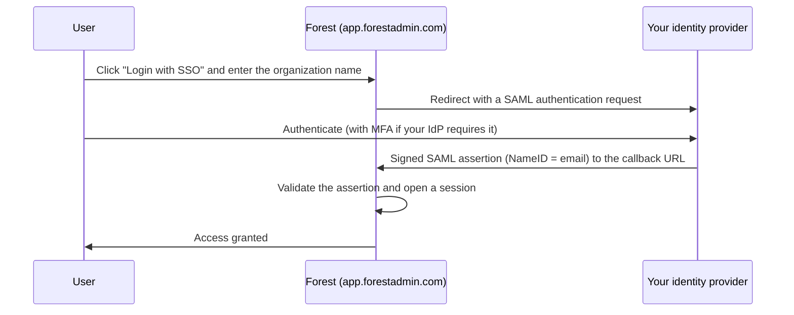

Single Sign-On lets your users access Forest with their existing corporate credentials, managed by your identity provider (IdP). Forest supports the **SAML 2.0** specification, so any SAML 2.0-compliant IdP can be used.

SSO is configured once, at the **organization** level, by an **organization owner**. A single identity provider is configured per organization.

## How SSO works

Forest uses a standard SP-initiated SAML 2.0 flow: the user starts at Forest, authenticates against your IdP, and is redirected back with a signed assertion.

## Forest SAML settings

When you declare Forest as an application in your IdP, use these values (the audience / Entity ID is shown in your organization settings):

| Setting | Value |
|---------|-------|
| Callback / ACS URL | `https://api.forestadmin.com/api/saml/callback` |
| Sign-on URL | `https://api.forestadmin.com/api/saml/callback` |
| Logout URL | `https://app.forestadmin.com/login` |
| `NameID` | The user's **email address** (must match their Forest account) |

## Configuring SSO

<Steps>
  <Step title="Open your organization's security settings">
    As an organization owner, go to **Organization settings → Security** and open the SSO configuration.
  </Step>
  <Step title="Declare Forest in your identity provider">
    Create a SAML 2.0 application in your IdP using the Forest SAML settings above. Make sure the `NameID` it returns is the user's email address.
  </Step>
  <Step title="Provide your IdP metadata to Forest">
    Give Forest your IdP's metadata in one of these ways:

    - **XML metadata endpoint URL** (recommended): paste the metadata URL exposed by your IdP.
    - **XML metadata file**: upload the metadata file downloaded from your IdP.
    - **Manual entry**: enter the login endpoint, the logout endpoint, and a valid signing certificate.
  </Step>
  <Step title="Test and enable">
    Test the configuration, then enable it. Once SSO is enabled, all users must log in again.
  </Step>
</Steps>

<Warning>
Users must already exist in Forest (or be provisioned through [SCIM](/get-started/control/authentication/scim)) with the same email address used by your IdP. The `NameID` returned in the SAML assertion must equal that email.
</Warning>

## How users log in with SSO

On the Forest login page, click **"Login with SSO"**, enter your organization name, and click **"Login"**. The user is redirected to your IdP and back to Forest once authenticated.

## IdP-initiated login (optional)

Forest also accepts IdP-initiated logins, where the user starts from your IdP's portal and opens Forest from there.

<Warning>
IdP-initiated login introduces a security risk associated with CSRF in the SAML protocol. Prefer SP-initiated login (starting from Forest) unless you specifically need the IdP-initiated flow.
</Warning>

## Provider guides

Forest works with any SAML 2.0 identity provider. Step-by-step guides are available for the most common ones:

<CardGroup cols={2}>
  <Card title="Google Workspace" icon="google" href="/get-started/control/authentication/sso-providers/google" />
  <Card title="Okta" icon="circle-check" href="/get-started/control/authentication/sso-providers/okta" />
  <Card title="Azure AD / Entra ID" icon="microsoft" href="/get-started/control/authentication/sso-providers/azure" />
  <Card title="AWS IAM Identity Center" icon="aws" href="/get-started/control/authentication/sso-providers/aws" />
  <Card title="Generic SAML 2.0" icon="diagram-project" href="/get-started/control/authentication/sso-providers/generic-saml" />
</CardGroup>
