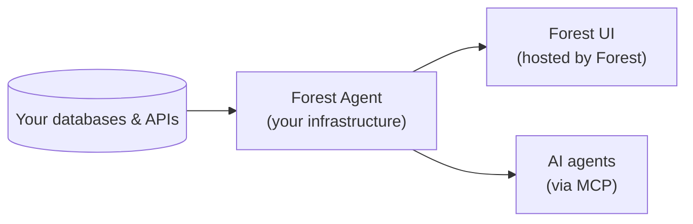

Forest is the operational infrastructure for regulated operations. It runs alongside your existing systems and gives your team, and your AI agents, one place to execute compliance workflows, business operations, and supplier coordination, with full governance and decision traces by default.

You keep full control of your data and infrastructure. Forest hosts the UI and configuration; the agent runs in your environment and your data never leaves your network.

## How it works

Forest runs through an **agent**, a lightweight backend you deploy alongside your application. The agent connects to your databases, exposes your business logic and workflows, and serves the API that the Forest UI (and any AI agents you connect) consume.

The agent does three things:

1. **Connects to your data**, SQL, MongoDB, ActiveRecord, Mongoose, Sequelize, APIs, custom datasources. Multiple sources in one agent are supported by default.
2. **Runs your business logic**, custom actions, computed fields, hooks, validations. Defined in code, executed where your data lives.
3. **Exposes everything safely**, to your operations team via the Forest UI, and to AI agents via the built-in MCP server. Same permissions, same audit trail, regardless of who or what is asking.

## What you'll build in this guide

By the end of this guide you'll have:

- A self-hosted agent running in production, connected to your database
- A configured Forest UI your team can use daily
- Custom actions and computed fields tied to your business logic
- Workflows and workspaces formalizing your operations
- An MCP server exposing your data and workflows to AI agents under the same governance
- Your team invited with the right permissions

## Prerequisites

Before you start:

- Node.js 18+ installed (or Ruby 3.0+ if you're using the Ruby agent)
- A database with a connection URI ready (PostgreSQL, MySQL, MongoDB, SQL Server, etc.)
- A Forest account, [sign up here](https://app.forestadmin.com/signup) if you don't have one
- Comfortable with a terminal

<Card title="Start with the Quickstart" icon="rocket" href="/get-started/quickstart">
  Get your agent running in 10 minutes.
</Card>
