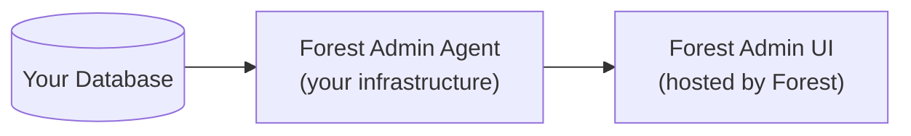

Forest Admin generates an admin panel on top of your existing database. You keep full control of your data and infrastructure — Forest Admin handles the UI.

## How it works

Forest Admin runs through an **agent**: a lightweight application you deploy alongside your backend. The agent connects to your database, handles your business logic, and exposes an API that the Forest Admin UI consumes. Your data never leaves your infrastructure.

## What you'll build in this guide

By the end of this guide you'll have:

- A self-hosted agent running in production, connected to your database
- A customized panel your team can use daily
- Actions and computed fields tailored to your business logic
- Workflows and workspaces for your operations
- Your team invited with the right permissions

## Prerequisites

Before you start:

- **Node.js 18+** installed
- **A database** with a connection URI ready (PostgreSQL, MySQL, MongoDB, etc.)
- **A Forest Admin account** — [sign up here](https://app.forestadmin.com/signup) if needed
- Comfortable with a terminal

<Card title="Start with the Quickstart →" icon="arrow-right" href="/get-started/quickstart">
  Get your agent running in 10 minutes
</Card>
