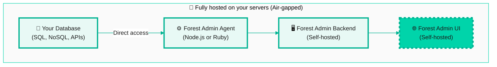

## On-Premise Deployment

On-Premise deployment provides complete control and isolation by running all Forest Admin components (agent, backend, and UI) within your infrastructure.

**Architecture:**

## Enterprise Feature

On-Premise deployment is an **enterprise feature** that requires:

- Enterprise license
- Custom configuration and setup
- Dedicated support from our team
- Full infrastructure management on your side



**Not available for self-service installation.** On-Premise deployment requires coordination with Forest Admin's team to ensure proper setup and licensing.



## What You Get

With On-Premise deployment:

- ✅ **Complete air-gapped deployment** - No external connections required
- ✅ **Full data sovereignty** - All components run in your network
- ✅ **Maximum security** - Ideal for highly regulated industries
- ✅ **Custom deployment** - Tailored to your infrastructure
- ✅ **Dedicated support** - Enterprise-level assistance

## Next Steps

To deploy Forest Admin On-Premise:

* [Book a Demo](https://www.forestadmin.com/demo) - Schedule a call to see On-Premise in action and discuss your requirements with our enterprise team

## Alternative Options

If On-Premise seems like overkill for your needs, consider:

  * [Self-Hosted](/get-started/quickstart-self-hosted.md) - Deploy the agent in your infrastructure while using our hosted UI

  * [Cloud](/get-started/quickstart-cloud.md) - Let us manage everything for you

