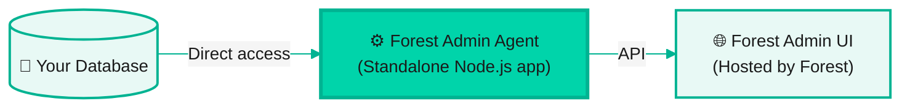
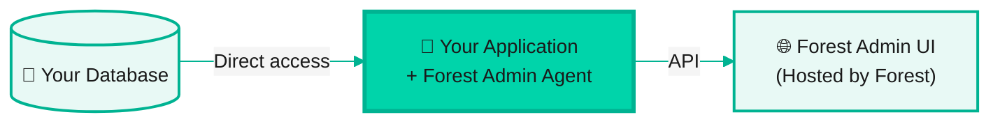

With Self-Hosted deployment, you run the Forest Admin agent in your infrastructure while using our hosted UI. This gives you full control over your data and business logic.

## What you'll do

1. **Choose your architecture** - Standalone microservice or in-app integration
2. **Set up the agent** - Follow the onboarding flow to configure Forest Admin
3. **Start your agent** - Launch the agent and access your admin panel

## Prerequisites

Before you begin, make sure you have:

- **Node.js 18+** or **Ruby 3.0+** installed
- **A database** (PostgreSQL, MySQL, MongoDB, etc.)
- **Forest Admin account** - [Sign up here](https://app.forestadmin.com/signup) if needed

## Step 1: Choose your architecture

Forest Admin can be deployed in two ways:

### Architecture 1: Standalone microservice

A **dedicated Node.js application** that only runs Forest Admin. This is ideal for:
- Keeping Forest Admin separate from your main application
- Using Forest Admin with multiple services or databases
- Maximum isolation and independent scaling

**Architecture:**



### Architecture 2: In-app integration

**Integrate Forest Admin directly into your existing application**. This is ideal for:
- Simpler deployment alongside your existing app
- Sharing code, middleware, and infrastructure
- Single application to manage

**Architecture:**



Choose the architecture that best fits your needs and continue with the appropriate guide below.

## Step 2: Set up the agent

<details>
<summary><strong>Option 1: Standalone</strong></summary>

### Follow the onboarding flow

1. Go to [app.forestadmin.com](https://app.forestadmin.com) and create a new project
2. Choose **"Self-Hosted"** deployment
3. Select **"Standalone application"** option
4. Follow the onboarding instructions. They will guide you to:
   - Install Forest Admin CLI: `npm install -g forest`
   - Login to Forest Admin: `forest login`
   - Generate the standalone application: `forest create:project`

When this is done, you are prompted to start your newly created agent:

```bash
npm start
```

🎉 **Congratulations!** Your agent should start on port `3310` by default and display:
```
[Forest] 🌳  Your agent is now running at http://localhost:3310
```


This command automatically generates a standalone application, with all the files necessary to make Forest Admin work, including a first `.env` with the environment variables such as `FOREST_ENV_SECRET` and `FOREST_AUTH_SECRET`.



Never commit your `.env` file to version control. Add it to `.gitignore`.


</details>

<details>
<summary><strong>Option 2: In-app (Node.js)</strong></summary>

Forest Admin integrates with popular Node.js frameworks: **Express**, **Fastify**, **Koa**, **NestJS**, and more.

### Follow the onboarding flow

1. Go to [app.forestadmin.com](https://app.forestadmin.com) and create a new project
2. Select **"In-app integration"** option
3. Choose your framework (**Express**, **Fastify**, **Koa**, **NestJS**)
4. Follow the onboarding instructions. They will provide you with:
   - Installation command for Forest Admin packages
   - Ready-to-use code snippet with your `FOREST_ENV_SECRET` and `FOREST_AUTH_SECRET` already configured
   - Instructions on where to add the code in your application

5. Add the provided code to your application and start your app:

```bash
npm start
# Or
npm run dev
```

🎉 **Congratulations!** The Forest Admin agent will start on port `3310` alongside your application.


Never commit your `.env` file to version control. Add it to `.gitignore`.


</details>

<details>
<summary><strong>Option 3: In-app (Ruby)</strong></summary>

Forest Admin integrates seamlessly with **Ruby on Rails** applications.

### Follow the onboarding flow

1. Go to [app.forestadmin.com](https://app.forestadmin.com) and create a new project
2. Select **"In-app integration"** option
3. Choose **Ruby on Rails**
4. Follow the onboarding instructions. They will provide you with:
   - Installation command for the Forest Admin gem
   - Ready-to-use configuration with your `FOREST_ENV_SECRET` and `FOREST_AUTH_SECRET` already configured
   - Instructions on where to add the configuration in your Rails application

5. Add the provided configuration to your application and start your app:

```bash
rails server
```

🎉 **Congratulations!** Your application (including Forest Admin) will start on port `3000` by default.


Never commit your `.env` file to version control. Add it to `.gitignore`.


</details>

## Step 3: Access your admin panel

Once your agent is running, **Forest Admin automatically opens your admin panel in the browser**.

🎉 **Congratulations!** Your admin panel is ready.

Forest Admin automatically:
- ✅ Discovered your database schema
- ✅ Analyzed relationships between tables
- ✅ Created collections for each table
- ✅ Set up CRUD operations
- ✅ Configured search and filters
- ✅ Generated a default layout

After an optional review, you can immediately access the Forest Admin UI to manage your data.

## What's next?


  * [Follow a Learning Path](/guides/learning-paths.md) - Structured learning journey tailored to your role
  * [Customize your UI](/product/build/layout-editor.md) - Use the layout editor to customize your admin panel
  * [Add business logic](/product/process/actions/overview.md) - Create Smart Actions for custom workflows


## Need help?

- **Documentation**: [Self-Hosted Architecture](/product/integration/architectures/self-hosted)
- **Setup Guides**: [Node.js Setup](/product/integration/setup/nodejs) | [Ruby Setup](/product/integration/setup/ruby)
- **Community**: [community.forestadmin.com](https://community.forestadmin.com)
- **Support**: [support@forestadmin.com](mailto:support@forestadmin.com)
