<Warning>
**Internal draft.** This page is a staging area to review the branded diagrams in Mermaid. Each block notes its destination page. Once validated, diagrams move to those pages and this page is deleted.
</Warning>

House style: `%%{init}%%` block forces the Forest palette; semantic `classDef`s — 🟩 `forest` (Forest components) · ⬜ `external` (your infra / external) · 🟧 `audit` (governance) · 🟥 `danger` (blocked/error).

---

## 1. Hooks lifecycle

**Destination:** [product/process/advanced-concepts/hooks/overview](/product/process/advanced-concepts/hooks/overview) · type: flowchart

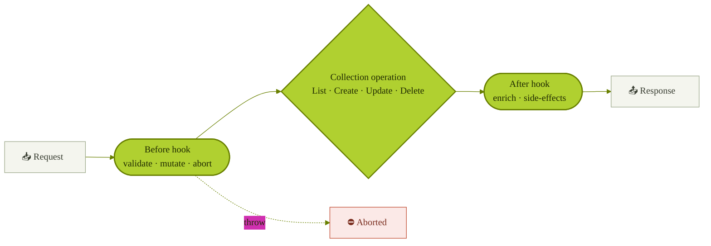

---

## 2. Approval flow

**Destination:** [collaborate/approval-workflows](/product/collaborate/approval-workflows) **and** [control/roles-permissions §approval](/get-started/control/roles-permissions) (one shared diagram). Two candidate views below.

### 2a. Lifecycle (stateDiagram)

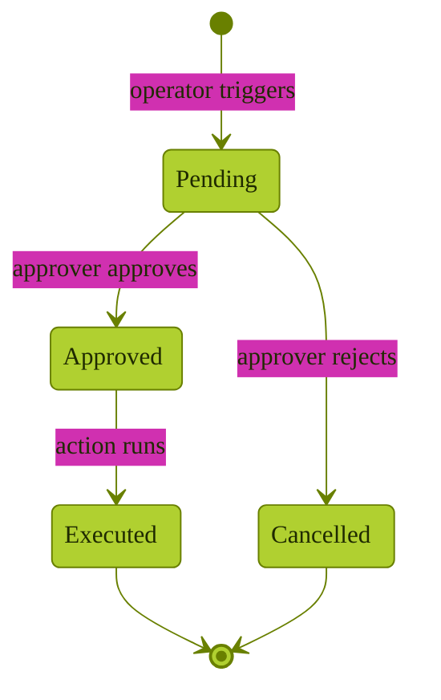

### 2b. Actors (sequenceDiagram)

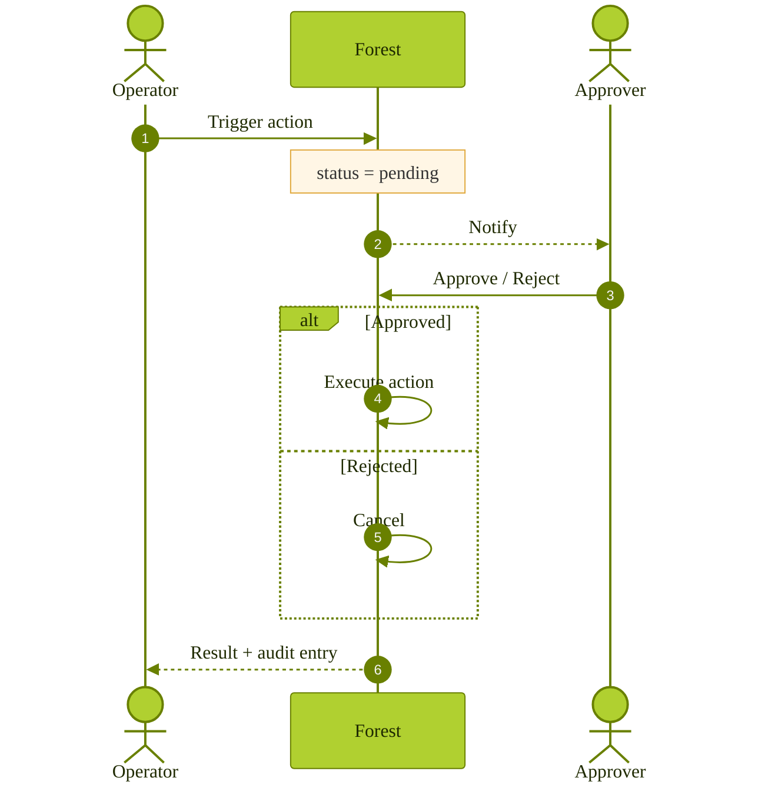

---

## 3. Replication strategies

**Destination:** [connect/data-sources/custom-datasources/replication](/get-started/connect/data-sources/custom-datasources/replication) · type: flowchart

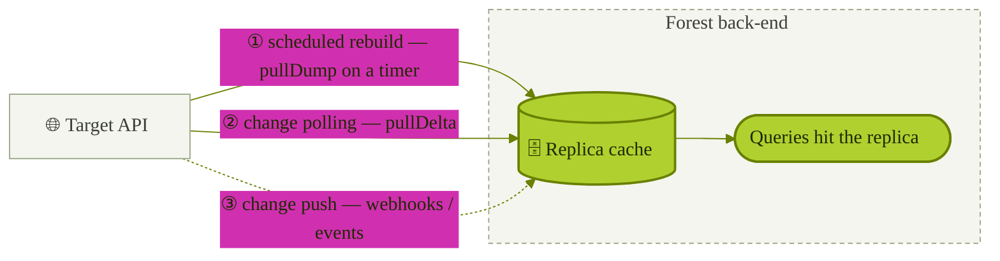

---

## 4. MCP server — standalone vs mounted

**Destination:** [embed/mcp-server §enabling](/product/embed/mcp-server) · type: two flowcharts

### 4a. Standalone (separate service)

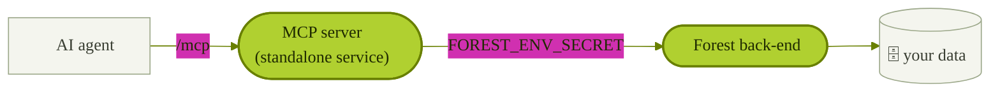

### 4b. Mounted (inside the back-end)

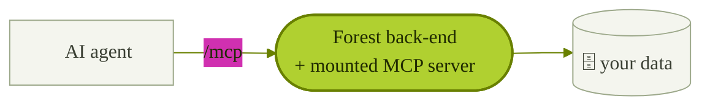

---

## 5. SCIM provisioning

**Destination:** [control/authentication/scim](/get-started/control/authentication/scim) · type: sequenceDiagram (replaces the ASCII art)

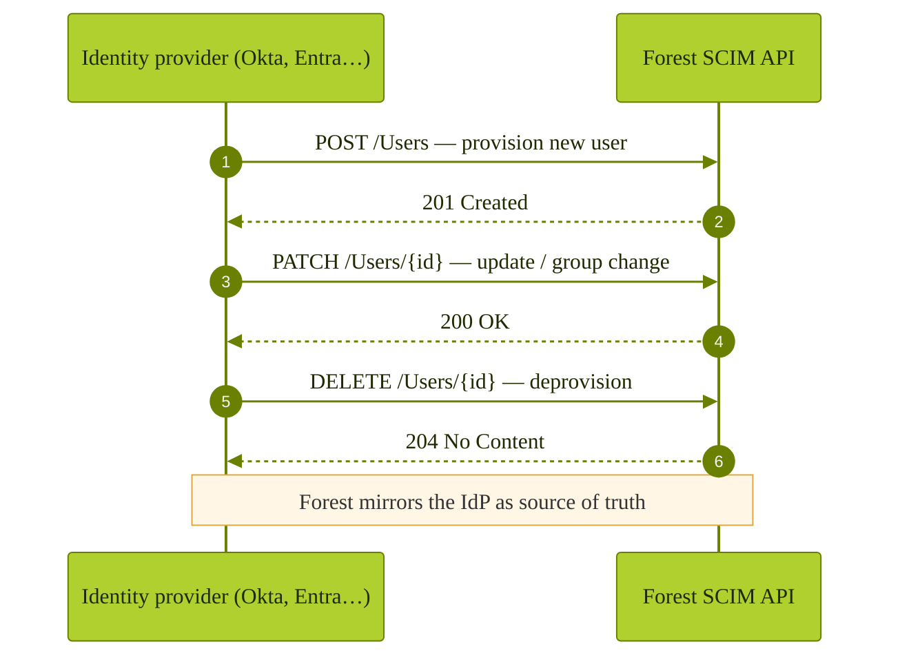

---

# Earlier-planned diagrams

## 6. MCP governance flow

**Destination:** [get-started/expose-to-ai-agents](/get-started/expose-to-ai-agents) · type: flowchart

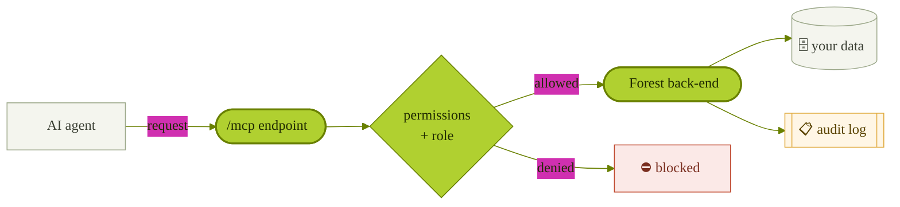

## 7. Permission levels vs roles

**Destination:** [get-started/invite-your-team](/get-started/invite-your-team) · type: flowchart

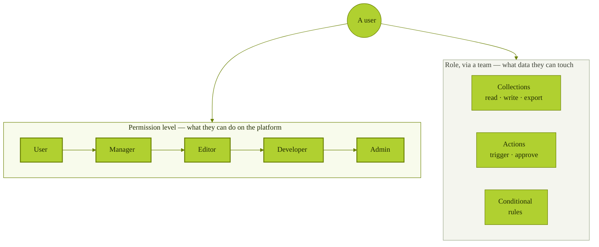

## 8. Environments & branches

**Destination:** [get-started/deploy](/get-started/deploy) (align with the [guides/deployment](/guides/deployment/development-workflow) versions) · type: flowchart

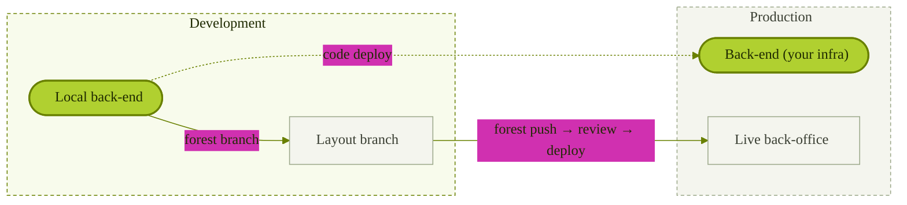

---

# Rebrands of existing diagrams

## 9. Architecture (reference style — already live in the Introduction)

**Destination:** [get-started/intro-to-forest-admin](/get-started/intro-to-forest-admin) (already applied)

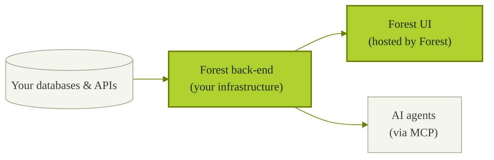

## 10. SSO login (rebrand of the existing sequence)

**Destination:** [control/authentication/sso](/get-started/control/authentication/sso)

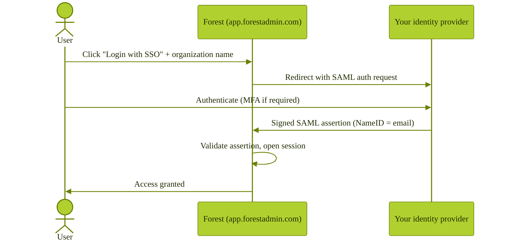

## 11. Self-hosted data flow (rebrand + "Your Agent" → "Your Forest back-end")

**Destination:** [connect/architectures/self-hosted](/get-started/connect/architectures/self-hosted)

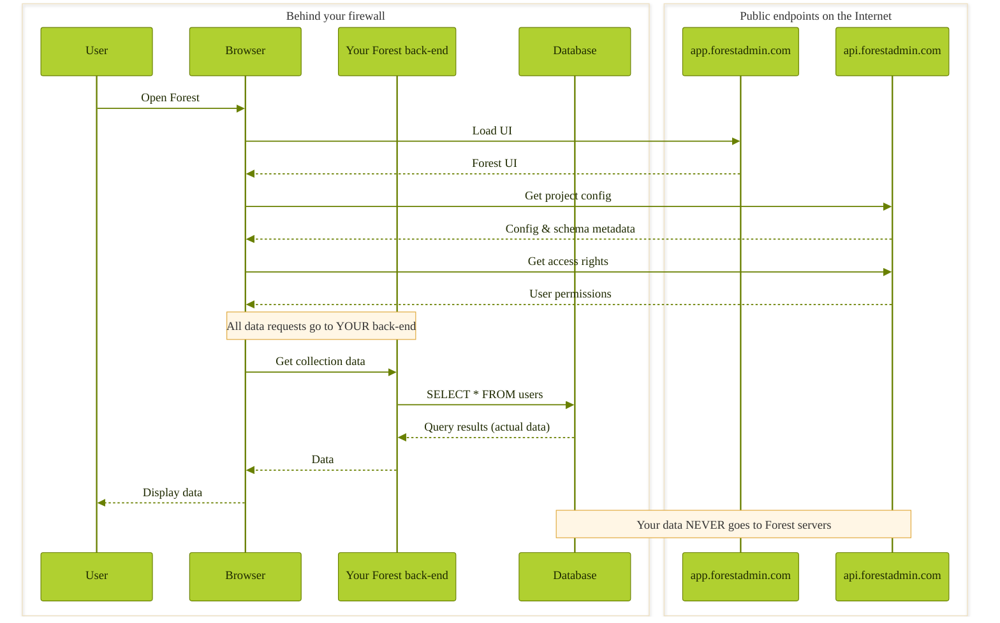
