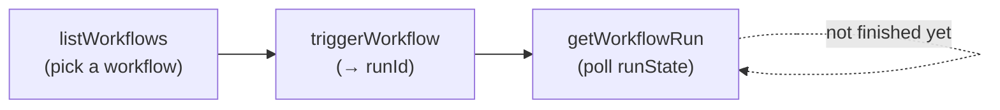

# What is the Model Context Protocol (MCP)?

The Model Context Protocol (MCP) is an open standard for connecting AI assistants to external data and tools through natural language.

# What can the Forest MCP do?

The Forest MCP server lets AI tools like Claude, Dust, and others to:

- Access collection schemas
- Securely query and browse your data
- Execute actions on records
- Start [Workflows](/product/process/workflows/overview) on a record and follow their progress

All of this while respecting the Roles & Permissions of your Forest project, and logging every activity, just like if they were performed through the UI.

The Forest MCP Server also enables other third party apps to embed and access Forest data and actions, for example in [Zendesk](/product/embed/zendesk), or [n8n](/product/embed/n8n).

# Enabling the Forest MCP Server

There are 2 ways to configure the Forest MCP Server:

- **Standalone**: the Forest MCP Server runs as an standalone service, pointing to your existing node.js or ruby back-end
- **Mounted**: the Forest MCP Server runs as part of your node.js back-end

## Standalone Forest MCP Server

To run your Forest MCP Server as a standalone service, you will first need to download the mcp-server package:

```text
npm install @forestadmin/mcp-server
```

You will then need to provide your FOREST\_ENV\_SECRET and FOREST\_AUTH\_SECRET variables to start the Forest MCP Server, to ensure it can authenticate and access the right back-end, corresponding to your project and environment of choice:

```text
FOREST_ENV_SECRET=xxx FOREST_AUTH_SECRET=xxx npx forest-mcp-server
```

<Note>
  Follow [this guide](/get-started/connect/environment-variables) to retrieve your AUTH and ENV secrets for the relevant environment.
</Note>

### Standalone configuration

The standalone Forest MCP Server is configured entirely through environment variables:

| Variable | Required | Default | Description |
| --- | --- | --- | --- |
| `FOREST_ENV_SECRET` | Yes | — | Your environment secret, used to authenticate and reach the right back-end. |
| `FOREST_AUTH_SECRET` | Yes | — | Your authentication secret. Must match the one of the corresponding back-end. |
| `MCP_SERVER_PORT` | No | `3931` | Port the standalone server listens on. |
| `FOREST_MCP_ENABLED_TOOLS` | No | all tools | Comma-separated allowlist of tools to expose (see [Restrict tools](#restrict-tools)). |
| `FOREST_AGENT_URL` | No | your environment's back-end URL | URL the MCP Server uses to reach your back-end's data layer. |
| `FOREST_MCP_ACCESS_TOKEN_TTL_SECONDS` | No | `3600` (1 hour) | Shortens the OAuth access token lifetime (see [Token lifetimes](#token-lifetimes)). Minimum `60`. |
| `FOREST_MCP_REFRESH_TOKEN_TTL_SECONDS` | No | unbounded | Shortens the time between two interactive logins (see [Token lifetimes](#token-lifetimes)). Minimum `60`. |
| `FOREST_MCP_ALLOWED_OAUTH_CLIENTS` | No | any registered client | Comma-separated domains of the OAuth clients allowed to connect (see [Restrict which AI clients can connect](#restrict-which-ai-clients-can-connect)). |

<Note>
  Set `FOREST_AGENT_URL` when the MCP Server runs next to a self-hosted back-end reachable at an internal address (e.g. `http://localhost:3310`), so tool calls hit it directly instead of the public back-end URL registered in Forest.
</Note>

Your Forest MCP Server will be accessible at this URL: `{your-standalone-server-url}/mcp`


## Mounted Forest MCP Server

<Note>
  This is only available with the node.js back-end. For other back-ends, refer to the Standalone method further down.
</Note>


In your node.js's `index.js` file, simply call the `mountAiMcpServer()` method when creating the back-end, for example:

```text
const agent = createAgent(options).addDataSource(/* ... */).mountAiMcpServer();
```

Upon restarting your back-end, the Forest MCP Server will automatically start, as confirmed by the following console log:

```text
info: [MCP] Server initialized successfully
```

Your Forest MCP Server URL will be `{your-agent-url}/mcp`

<Note>
  Your back-end URL can be found in the Forest UI's Project Settings, under the Environments tab.

  Note that each Environment has its own Back-end URL, and therefore its own Forest MCP Server URL.
</Note>

<Warning>
  When mounted, the MCP server intercepts the **entire** `/oauth/*` and `/.well-known/*` namespaces plus `/mcp` at your back-end's root. Any request in those namespaces is captured by the MCP server — if it doesn't serve that exact route (or your back-end already does), the request gets a 404/405 **instead of reaching your back-end**. So your own `/oauth/callback` or `/.well-known/apple-app-site-association` would break, not just OAuth.

  Pass a `basePath` to narrow the MCP server to a dedicated prefix so your routes are left untouched. The OAuth and protocol routes move under the prefix; the `.well-known` discovery documents stay at the root (as OAuth discovery requires) but are served at prefix-suffixed paths such as `/.well-known/oauth-authorization-server/ai`, narrowing the `.well-known` claim to just those two paths:

  ```text
  const agent = createAgent(options).addDataSource(/* ... */).mountAiMcpServer({ basePath: '/ai' });
  ```

  Your Forest MCP Server URL then becomes `{your-agent-url}/ai/mcp`. Because OAuth discovery must stay at the origin root, `basePath` requires your agent to be served at the domain root (it throws at startup if the agent URL already includes a path), and root `/.well-known/*` requests must still reach the agent.

  The prefix applies to every route, including the protocol endpoint — so `basePath: '/mcp'` would make the endpoint `/mcp/mcp`. Prefer a distinct prefix such as `/ai` to avoid the repetition.
</Warning>

# Available tools

The Forest MCP server exposes the following capabilities:

### Read

| Tool                 | Description                                           |
| -------------------- | ----------------------------------------------------- |
| `describeCollection` | Get schema of a collection (fields, types, relations) |
| `list`               | Search and list records with filters and pagination   |
| `listRelated`        | List related records                                  |

### Write

| Tool         | Description                     |
| ------------ | ------------------------------- |
| `create`     | Create a new record             |
| `update`     | Update an existing record       |
| `delete`     | Delete one or more records      |
| `associate`  | Link records through a relation |
| `dissociate` | Unlink records from a relation  |

### Actions

| Tool            | Description                        |
| --------------- | ---------------------------------- |
| `getActionForm` | Get form fields for a smart action |
| `executeAction` | Execute a smart action             |

### Workflows

| Tool              | Description                                                  |
| ----------------- | ------------------------------------------------------------ |
| `listWorkflows`   | Discover the workflows enabled for MCP triggering            |
| `triggerWorkflow` | Start a workflow run on a record                             |
| `getWorkflowRun`  | Poll the status of a run started through MCP                 |

<Note>
  Workflows are **opt-in per workflow**: only those whose **MCP** trigger is enabled are visible to these tools. See [Triggering workflows from an AI assistant](#triggering-workflows-from-an-ai-assistant).
</Note>

## Restrict tools

You can restrict which tools the MCP server exposes using `enabledTools`. Only the tools you list will be available, and **new tools added in future releases will NOT be automatically enabled**, so your configuration stays safe over time.

<CodeGroup>

```javascript Mounted on agent
agent.mountAiMcpServer({
  enabledTools: ['describeCollection', 'list', 'listRelated'],
});
```

```bash Standalone
FOREST_MCP_ENABLED_TOOLS="describeCollection,list,listRelated" \
  FOREST_ENV_SECRET=xxx FOREST_AUTH_SECRET=xxx npx forest-mcp-server
```

</CodeGroup>

When `enabledTools` is not set, all tools are enabled by default.

<Info>
  `describeCollection` is always enabled, even if omitted from the list, as it is required for the MCP server to function properly.
</Info>

## Restrict which AI clients can connect

By default, any OAuth client application can register against the MCP server through Dynamic Client Registration and, once one of your users signs in, obtain tokens. Use `allowedOAuthClients` (`@forestadmin/agent` ≥ 1.92.0, `@forestadmin/mcp-server` ≥ 1.21.0) to accept only approved client applications:

<CodeGroup>

```javascript Mounted on agent
agent.mountAiMcpServer({
  allowedOAuthClients: ['dust.tt'],
});
```

```bash Standalone
FOREST_MCP_ALLOWED_OAUTH_CLIENTS="dust.tt" \
  FOREST_ENV_SECRET=xxx FOREST_AUTH_SECRET=xxx npx forest-mcp-server
```

</CodeGroup>

A client is allowed only when **every** redirect URI it registered is an `http(s)` URI on a listed domain or one of its subdomains (`dust.tt` matches `eu.dust.tt`). Matching uses redirect URIs because they are the one piece of registration metadata an impostor cannot benefit from — the authorization code is only ever delivered there. Self-declared fields such as the client name are ignored, and custom (non-`http(s)`) scheme URIs are rejected even on an allowed domain, because they deliver the callback to whatever local application registered the scheme.

Every other client is rejected with a standard OAuth `invalid_client` error telling the user to contact their administrator; the response does not reveal the allowed domains. Registration itself still succeeds — it happens on the Forest server — the client just cannot use it against your MCP server. Access tokens issued before you enabled the option stay valid until they expire (1 hour at most); refreshes are blocked immediately.

<Warning>
  Native desktop clients (Claude Desktop, MCP Inspector, ...) register `localhost` redirect URIs, so they are always rejected when the allowlist is set. There is deliberately no loopback exemption: allowing `localhost` would allow every local application. Omit the option in environments that need native clients (e.g. development).
</Warning>

## Token lifetimes

The MCP server issues OAuth tokens whose lifetimes come from Forest: **1 hour** (3600s) for an access token, **8 days** (691200s) for a refresh token. Forest re-grants those 8 days on *every* refresh, so without `refreshTokenSeconds` an assistant that keeps working is never asked to sign in again. You can shorten them with `tokenTtl`, to reduce how long a leaked token stays usable and to force users to log in again periodically.

<CodeGroup>

```javascript Mounted on agent
agent.mountAiMcpServer({
  tokenTtl: {
    accessTokenSeconds: 900,
    refreshTokenSeconds: 86400,
  },
});
```

```bash Standalone
FOREST_MCP_ACCESS_TOKEN_TTL_SECONDS=900 \
  FOREST_MCP_REFRESH_TOKEN_TTL_SECONDS=86400 \
  FOREST_ENV_SECRET=xxx FOREST_AUTH_SECRET=xxx npx forest-mcp-server
```

</CodeGroup>

The two settings differ in what your users notice:

| Setting               | Forest default | What it bounds                                | Effect on the user                                          |
| --------------------- | -------------------- | --------------------------------------------- | ----------------------------------------------------------- |
| `accessTokenSeconds`  | 1 hour               | How long an issued access token drives the MCP server | None — the AI assistant silently obtains a new one   |
| `refreshTokenSeconds` | unbounded            | The time between two **interactive logins**   | Once it elapses, the user logs in through the browser again |

`refreshTokenSeconds` is measured from the login itself, not from the last refresh, so an assistant that keeps working cannot keep extending its own session. Refresh tokens issued before you enabled the option carry no login timestamp, so their window is measured from their last refresh instead — one longer session each, then bounded.

<Warning>
  Both values are upper bounds: they can only **shorten** what Forest granted, never extend it. For `accessTokenSeconds`, a value above Forest's own token lifetime has no effect. `refreshTokenSeconds` bounds the whole session, which Forest otherwise re-extends on every refresh, so any value shortens it however large it is.
</Warning>

<Warning>
  `accessTokenSeconds` bounds what a leaked token can do through the MCP server — its scopes stop applying and its calls stop being audited. It does **not** shorten the Forest token carried inside that JWT, which is signed rather than encrypted: treat a leak as a Forest token leak and revoke at the source.
</Warning>

<Info>
  The minimum for either value is 60 seconds; a lower value is raised to it. An invalid value (zero, negative or fractional) stops the server at startup rather than silently leaving your tokens uncapped.
</Info>

## Connect your AI assistant

Your MCP endpoint is available at `/mcp` (`<your-agent-url>/mcp` when mounted, `<your-standalone-server-url>/mcp` when standalone). On first connection, a browser window opens for you to log in with your Forest credentials; the assistant then operates with that user's permissions.

<CodeGroup>

```bash Claude Code
claude mcp add --transport http forest-admin <your-mcp-endpoint>
```

```json Claude Desktop
{
  "mcpServers": {
    "forest-admin": {
      "command": "npx",
      "args": ["-y", "mcp-remote", "<your-mcp-endpoint>"]
    }
  }
}
```

```json Cursor
{
  "mcpServers": {
    "forest-admin": {
      "url": "<your-mcp-endpoint>"
    }
  }
}
```

```json VS Code
{
  "servers": {
    "forest-admin": {
      "type": "http",
      "url": "<your-mcp-endpoint>"
    }
  }
}
```

```toml Codex (OpenAI)
[mcp_servers.forest-admin]
url = "<your-mcp-endpoint>"
```

</CodeGroup>

<Info>
  Use the MCP transport type `"http"` (not `"sse"` or `"url"`): the Forest MCP server uses Streamable HTTP. Your URL should still use `https://`. Clients that rely on `mcp-remote` (Claude Desktop, Windsurf, JetBrains) require Node.js 18\+ (some versions need 20\+).
</Info>

## Triggering workflows from an AI assistant

Three tools let an assistant drive a [Workflow](/product/process/workflows/overview) end-to-end from its own context: pick a workflow that fits the record at hand, start it, then watch the run.

<Info>
  A workflow is only reachable through MCP once an editor enables its **MCP** trigger in the workflow's [trigger settings](/product/process/workflows/triggers#the-mcp-trigger). Nothing is exposed by default.
</Info>

### Discover → trigger → poll

The three tools are meant to be chained, and the split is deliberate: MCP has no push channel, and a run is asynchronous — it can be long, or parked waiting for a person. So `triggerWorkflow` returns immediately with a `runId`, and the assistant polls `getWorkflowRun` for as long as it cares about the outcome.



1. **Discover** — `listWorkflows` returns the MCP-enabled workflows the connected user can reach, with the collection each one operates on. Pass `collectionName` to narrow it to the collection of the record in context.
2. **Trigger** — `triggerWorkflow` starts a run on one record and returns its `runId`. The run continues server-side; nothing blocks.
3. **Poll** — `getWorkflowRun` reports the run's state, the step it is on, whether it is waiting for a human, and, once terminal, its result or error.

### `listWorkflows`

Lists workflows with the MCP trigger enabled, scoped to the connected user's rendering and permissions.

| Argument | Description |
|---|---|
| `collectionName` | Optional. Narrows the results to workflows operating on that collection — typically the collection of the record in context. |

```json Returns
[
  {
    "workflowId": "9f1b0c4e-2f7a-4d5b-9e31-6c0a8b7d1234",
    "name": "KYC review",
    "collectionName": "customers"
  }
]
```

An empty array means no workflow is MCP-enabled for that user — most often because nobody has turned the toggle on yet.

### `triggerWorkflow`

Starts a run of an MCP-enabled workflow on a specific record.

| Argument | Description |
|---|---|
| `workflowId` | As returned by `listWorkflows`. Its MCP trigger must be enabled. |
| `recordId` | The record to run on. Composite primary keys use the packed form, values joined by `\|` (e.g. `"123\|456"`). |

```json Returns
{ "runId": 1234, "runState": "loading" }
```

`runId` is what every subsequent `getWorkflowRun` call needs. `runState` is only the state at that instant — it depends on the workflow's first step, and it moves on without further calls, so treat it as a starting point, not an outcome.

<Note>
  The record is **not** checked when the run is created — the orchestrator has no data access at that point. An id that does not exist, or that the user cannot read, produces a run that fails at its first data step; the assistant sees it through `getWorkflowRun`'s `error`, not as a trigger-time failure.
</Note>

Only **one run per record** can be active at a time. Triggering a record that already has an ongoing run fails and does **not** resume it — the run in flight is left untouched.

### `getWorkflowRun`

Reads the normalized status of a run, given the `runId` returned by `triggerWorkflow`.

| Field | Description |
|---|---|
| `runState` | `pending` or `loading` while a step is queued or executing, `started` when the run is parked, `finished` on completion, `aborted` when stopped. |
| `currentStep` | The step the run sits on — its `name` and `type` (plus a `taskType` on task steps). `null` once the run is finished. |
| `waitingForHumanInput` | `true` when the run is parked on a step a person must handle. |
| `result` | The step the run ended on, populated only once `runState` is `finished`. |
| `error` | The failure recorded on the current step, including a first-data-step failure on an unreachable record. `null` otherwise. |

<CodeGroup>

```json Parked on a human step
{
  "runState": "started",
  "currentStep": {
    "name": "Review the KYB documents",
    "type": "task",
    "taskType": "guideline"
  },
  "waitingForHumanInput": true,
  "result": null,
  "error": null
}
```

```json Finished
{
  "runState": "finished",
  "currentStep": null,
  "waitingForHumanInput": false,
  "result": { "name": "Customer approved", "type": "end", "context": {} },
  "error": null
}
```

</CodeGroup>

<Warning>
  `getWorkflowRun` only exposes runs that were **started through MCP**. A run triggered manually or by webhook is not observable here, even by the same user — asking for its id returns a not-found error.
</Warning>

### Runs that need a human

In this first version the assistant can *observe* a parked run but not answer it. When `waitingForHumanInput` is `true`, the run is waiting in the workflow's **fallback inbox**, and someone finishes it from the Forest UI. Relaying the step's question into the chat and submitting the answer through MCP is planned, not available yet.

### Errors

Tool failures come back as tool errors with an explanatory message, so the assistant can react rather than crash:

| Situation | What the assistant gets |
|---|---|
| The workflow's MCP trigger is off, is unknown, or the user cannot reach it | Not found — with a hint to call `listWorkflows` |
| A run is already ongoing on that record | Conflict; no run is started and none is resumed |
| The `runId` is unknown, belongs to another user's rendering, or was not started through MCP | Not found |
| The project has no [Forest Runtime](/product/process/workflows/forest-runtime) installed | Conflict — automated triggering needs server-side execution |

### Identity, auditing, and limits

- **Identity** — the run executes as the Forest user of the MCP session, established by the OAuth login. Its permissions bound everything the run can read, write, or trigger.
- **Auditing** — each trigger is recorded in the run history and in your **Activity Logs**, attributed to that user and labelled *via MCP*, so MCP-started runs are distinguishable from manual and webhook ones.
- **Rate limiting** — the workflow tools have no dedicated limiter. They inherit the MCP server's authentication and limits; unlike the [webhook trigger](/reference/api/endpoints/trigger-workflow-webhook#rate-limiting), there is no anonymous surface to protect. The single-run-per-record rule also absorbs repeated triggers on the same record.
- **Turning it off** — drop `triggerWorkflow` from [`enabledTools`](#restrict-tools) to remove MCP triggering across all workflows, or disable a single workflow's MCP toggle. Either way, manual and webhook starts of that workflow keep working.

## Use cases

### AI-assisted operations

Use Claude or other AI assistants to:

- Answer questions about your data
- Generate reports and insights
- Automate routine tasks
- Perform data analysis

### Example prompts

> "Show me all pending orders from the last 24 hours"

> "What customers have the highest lifetime value?"

> "Execute the 'Send Invoice' action on order #12345"

> "Start the KYC review workflow on customer #482 and tell me where it gets to"

## Security

The Forest MCP server:

- Respects all Forest permissions and roles
- Uses your environment's authentication
- Logs all operations for audit purposes
- Never exposes sensitive data without proper access
- Lets you restrict which AI client applications can connect (see [Restrict which AI clients can connect](#restrict-which-ai-clients-can-connect))
- Lets you shorten the OAuth token lifetimes (see [Token lifetimes](#token-lifetimes))
- Exposes no workflow until an editor opts that workflow in (see [Triggering workflows](#triggering-workflows-from-an-ai-assistant))

<Warning>
  Only provide MCP server access to trusted AI tools and users. The server can perform any operation that the authenticated user can perform.
</Warning>