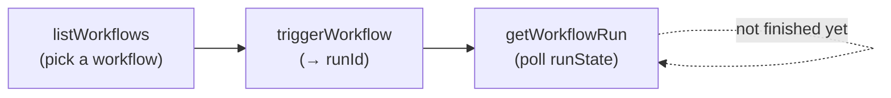

# What is the Model Context Protocol (MCP)?

The Model Context Protocol (MCP) is an open standard for connecting AI assistants to external data and tools through natural language.

# What can the Forest MCP do?

The Forest MCP server lets AI tools like Claude, Dust, and others to:

- Access collection schemas
- Securely query and browse your data
- Execute actions on records
- Start [Workflows](/product/process/workflows/overview) on a record and follow their progress

All of this while respecting the Roles & Permissions of your Forest project, and logging activity just like if it were performed through the UI — see [Identity, auditing, and limits](#identity-auditing-and-limits) for the four tools that are not logged.

The Forest MCP Server also enables other third party apps to embed and access Forest data and actions, for example in [Zendesk](/product/embed/zendesk), or [n8n](/product/embed/n8n).

# Enabling the Forest MCP Server

There are 2 ways to configure the Forest MCP Server:

- **Standalone**: the Forest MCP Server runs as an standalone service, pointing to your existing node.js or ruby back-end
- **Mounted**: the Forest MCP Server runs as part of your node.js back-end

## Standalone Forest MCP Server

To run your Forest MCP Server as a standalone service, you will first need to download the mcp-server package:

```text
npm install @forestadmin/mcp-server
```

You will then need to provide your FOREST\_ENV\_SECRET and FOREST\_AUTH\_SECRET variables to start the Forest MCP Server, to ensure it can authenticate and access the right back-end, corresponding to your project and environment of choice:

```text
FOREST_ENV_SECRET=xxx FOREST_AUTH_SECRET=xxx npx forest-mcp-server

# deployed
FOREST_MCP_SERVER_URL=https://mcp.example.com \
  FOREST_ENV_SECRET=xxx FOREST_AUTH_SECRET=xxx npx forest-mcp-server
```

<Note>
  Follow [this guide](/get-started/connect/environment-variables) to retrieve your AUTH and ENV secrets for the relevant environment.
</Note>

### Standalone configuration

The standalone Forest MCP Server is configured entirely through environment variables:

| Variable | Required | Default | Description |
| --- | --- | --- | --- |
| `FOREST_ENV_SECRET` | Yes | — | Your environment secret, used to authenticate and reach the right back-end. |
| `FOREST_AUTH_SECRET` | Yes | — | Your authentication secret. Must match the one of the corresponding back-end. |
| `MCP_SERVER_PORT` | No | `3931` | Port the standalone server listens on. |
| `FOREST_MCP_SERVER_URL` | Yes, when deployed | `http://localhost:<port>` | Public URL the server is reachable at — an http(s) origin, no path. An invalid value fails at startup. |
| `FOREST_MCP_ENABLED_TOOLS` | No | all tools | Comma-separated allowlist of tools to expose (see [Restrict tools](#restrict-tools)). |
| `FOREST_AGENT_URL` | No | your environment's back-end URL | URL the MCP Server uses to reach your back-end's data layer. |
| `FOREST_MCP_ACCESS_TOKEN_TTL_SECONDS` | No | `3600` (1 hour) | Shortens the OAuth access token lifetime (see [Token lifetimes](#token-lifetimes)). Minimum `60`. |
| `FOREST_MCP_REFRESH_TOKEN_TTL_SECONDS` | No | unbounded | Shortens the time between two interactive logins (see [Token lifetimes](#token-lifetimes)). Minimum `60`. |
| `FOREST_MCP_ALLOWED_OAUTH_CLIENTS` | No | any registered client | Comma-separated domains of the OAuth clients allowed to connect (see [Restrict which AI clients can connect](#restrict-which-ai-clients-can-connect)). |
| `FOREST_MCP_FILE_UPLOADS` | No | on | `false` turns action file uploads off (see [Action file uploads](#action-file-uploads)). |
| `FOREST_MCP_UPLOAD_STORAGE_MODULE` | No | in-memory store | Path to a module exporting the `fileUploads` options, for a real storage backend (see [Action file uploads](#action-file-uploads)). |

<Note>
  Set `FOREST_AGENT_URL` when the MCP Server runs next to a self-hosted back-end reachable at an internal address (e.g. `http://localhost:3310`), so tool calls hit it directly instead of the public back-end URL registered in Forest.
</Note>

Your Forest MCP Server will be accessible at this URL: `{your-standalone-server-url}/mcp`


## Mounted Forest MCP Server

<Note>
  This is only available with the node.js back-end. For other back-ends, refer to the Standalone method further down.
</Note>


In your node.js's `index.js` file, simply call the `mountAiMcpServer()` method when creating the back-end, for example:

```text
const agent = createAgent(options).addDataSource(/* ... */).mountAiMcpServer();
```

Upon restarting your back-end, the Forest MCP Server will automatically start, as confirmed by the following console log:

```text
info: [MCP] Server initialized successfully
```

Your Forest MCP Server URL will be `{your-agent-url}/mcp`

<Note>
  Your back-end URL can be found in the Forest UI's Project Settings, under the Environments tab.

  Note that each Environment has its own Back-end URL, and therefore its own Forest MCP Server URL.
</Note>

<Warning>
  When mounted, the MCP server intercepts the **entire** `/oauth/*` and `/.well-known/*` namespaces plus `/mcp` at your back-end's root. Any request in those namespaces is captured by the MCP server — if it doesn't serve that exact route (or your back-end already does), the request gets a 404/405 **instead of reaching your back-end**. So your own `/oauth/callback` or `/.well-known/apple-app-site-association` would break, not just OAuth.

  Pass a `basePath` to narrow the MCP server to a dedicated prefix so your routes are left untouched. The OAuth and protocol routes move under the prefix; the `.well-known` discovery documents stay at the root (as OAuth discovery requires) but are served at prefix-suffixed paths such as `/.well-known/oauth-authorization-server/ai`, narrowing the `.well-known` claim to just those two paths:

  ```text
  const agent = createAgent(options).addDataSource(/* ... */).mountAiMcpServer({ basePath: '/ai' });
  ```

  Your Forest MCP Server URL then becomes `{your-agent-url}/ai/mcp`. Because OAuth discovery must stay at the origin root, `basePath` requires your agent to be served at the domain root (it throws at startup if the agent URL already includes a path), and root `/.well-known/*` requests must still reach the agent.

  The prefix applies to every route, including the protocol endpoint — so `basePath: '/mcp'` would make the endpoint `/mcp/mcp`. Prefer a distinct prefix such as `/ai` to avoid the repetition.
</Warning>

# Available tools

The Forest MCP server exposes the following capabilities:

### Read

| Tool                 | Description                                           |
| -------------------- | ----------------------------------------------------- |
| `describeCollection` | Get schema of a collection (fields, types, relations) |
| `list`               | Search and list records with filters and pagination   |
| `listRelated`        | List related records                                  |

### Write

| Tool         | Description                     |
| ------------ | ------------------------------- |
| `create`     | Create a new record             |
| `update`     | Update an existing record       |
| `delete`     | Delete one or more records      |
| `associate`  | Link records through a relation |
| `dissociate` | Unlink records from a relation  |

### Actions

| Tool            | Description                        |
| --------------- | ---------------------------------- |
| `getActionForm` | Get form fields for a smart action |
| `executeAction` | Execute a smart action             |
| `requestActionFileUpload` | Get an upload destination for an action's `File` or `FileList` field |

### Workflows

| Tool              | Description                                                  |
| ----------------- | ------------------------------------------------------------ |
| `listWorkflows`   | Discover the workflows enabled for MCP triggering            |
| `triggerWorkflow` | Start a workflow run on a record                             |
| `getWorkflowRun`  | Poll the status of a run started through MCP                 |

<Note>
  Workflows are **opt-in per workflow**: `listWorkflows` and `triggerWorkflow` only see those whose **MCP** trigger is enabled. Turning the toggle off stops discovery and new triggers, but a run already started through MCP stays readable with `getWorkflowRun` until it finishes. See [Triggering workflows from an AI assistant](#triggering-workflows-from-an-ai-assistant).
</Note>

## Restrict tools

You can restrict which tools the MCP server exposes using `enabledTools`. Only the tools you list will be available, and **new tools added in future releases will NOT be automatically enabled**, so your configuration stays safe over time.

<CodeGroup>

```javascript Mounted on agent
agent.mountAiMcpServer({
  enabledTools: ['describeCollection', 'list', 'listRelated'],
});
```

```bash Standalone
FOREST_MCP_ENABLED_TOOLS="describeCollection,list,listRelated" \
  FOREST_ENV_SECRET=xxx FOREST_AUTH_SECRET=xxx npx forest-mcp-server
```

</CodeGroup>

When `enabledTools` is not set, all tools are enabled by default.

<Info>
  `describeCollection` is always enabled, even if omitted from the list, as it is required for the MCP server to function properly.
</Info>

## Restrict which AI clients can connect

By default, any OAuth client application can register against the MCP server through Dynamic Client Registration and, once one of your users signs in, obtain tokens. Use `allowedOAuthClients` (`@forestadmin/agent` ≥ 1.92.0, `@forestadmin/mcp-server` ≥ 1.21.0) to accept only approved client applications:

<CodeGroup>

```javascript Mounted on agent
agent.mountAiMcpServer({
  allowedOAuthClients: ['dust.tt'],
});
```

```bash Standalone
FOREST_MCP_ALLOWED_OAUTH_CLIENTS="dust.tt" \
  FOREST_ENV_SECRET=xxx FOREST_AUTH_SECRET=xxx npx forest-mcp-server
```

</CodeGroup>

A client is allowed only when **every** redirect URI it registered is an `http(s)` URI on a listed domain or one of its subdomains (`dust.tt` matches `eu.dust.tt`). Matching uses redirect URIs because they are the one piece of registration metadata an impostor cannot benefit from — the authorization code is only ever delivered there. Self-declared fields such as the client name are ignored, and custom (non-`http(s)`) scheme URIs are rejected even on an allowed domain, because they deliver the callback to whatever local application registered the scheme.

Every other client is rejected with a standard OAuth `invalid_client` error telling the user to contact their administrator; the response does not reveal the allowed domains. Registration itself still succeeds — it happens on the Forest server — the client just cannot use it against your MCP server. Access tokens issued before you enabled the option stay valid until they expire (1 hour at most); refreshes are blocked immediately.

<Warning>
  Native desktop clients (Claude Desktop, MCP Inspector, ...) register `localhost` redirect URIs, so they are always rejected when the allowlist is set. There is deliberately no loopback exemption: allowing `localhost` would allow every local application. Omit the option in environments that need native clients (e.g. development).
</Warning>

## Token lifetimes

The MCP server issues OAuth tokens whose lifetimes come from Forest: **1 hour** (3600s) for an access token, **8 days** (691200s) for a refresh token. Forest re-grants those 8 days on *every* refresh, so without `refreshTokenSeconds` an assistant that keeps working is never asked to sign in again. You can shorten them with `tokenTtl`, to reduce how long a leaked token stays usable and to force users to log in again periodically.

<CodeGroup>

```javascript Mounted on agent
agent.mountAiMcpServer({
  tokenTtl: {
    accessTokenSeconds: 900,
    refreshTokenSeconds: 86400,
  },
});
```

```bash Standalone
FOREST_MCP_ACCESS_TOKEN_TTL_SECONDS=900 \
  FOREST_MCP_REFRESH_TOKEN_TTL_SECONDS=86400 \
  FOREST_ENV_SECRET=xxx FOREST_AUTH_SECRET=xxx npx forest-mcp-server
```

</CodeGroup>

The two settings differ in what your users notice:

| Setting               | Forest default | What it bounds                                | Effect on the user                                          |
| --------------------- | -------------------- | --------------------------------------------- | ----------------------------------------------------------- |
| `accessTokenSeconds`  | 1 hour               | How long an issued access token drives the MCP server | None — the AI assistant silently obtains a new one   |
| `refreshTokenSeconds` | unbounded            | The time between two **interactive logins**   | Once it elapses, the user logs in through the browser again |

`refreshTokenSeconds` is measured from the login itself, not from the last refresh, so an assistant that keeps working cannot keep extending its own session. Refresh tokens issued before you enabled the option carry no login timestamp, so their window is measured from their last refresh instead — one longer session each, then bounded.

<Warning>
  Both values are upper bounds: they can only **shorten** what Forest granted, never extend it. For `accessTokenSeconds`, a value above Forest's own token lifetime has no effect. `refreshTokenSeconds` bounds the whole session, which Forest otherwise re-extends on every refresh, so any value shortens it however large it is.
</Warning>

<Warning>
  `accessTokenSeconds` bounds what a leaked token can do through the MCP server — its scopes stop applying and its calls stop being audited. It does **not** shorten the Forest token carried inside that JWT, which is signed rather than encrypted: treat a leak as a Forest token leak and revoke at the source.
</Warning>

<Info>
  The minimum for either value is 60 seconds; a lower value is raised to it. An invalid value (zero, negative or fractional) stops the server at startup rather than silently leaving your tokens uncapped.
</Info>

## Action file uploads

Actions with **File fields** work over MCP out of the box. The file never travels through the AI's
context window: the model asks for an upload destination, sends the bytes there directly, and
passes a signed reference — a *handle* — as the field value.

```
1. requestActionFileUpload {filename, mimeType, sha256}  →  uploadUrl + method + headers + fileHandle
2. send the bytes to uploadUrl, with that method and every returned header
3. executeAction {Document: fileHandle}                   →  the action receives the real file
```

Step 2 happens outside the MCP protocol, and the returned `method` and `headers` are not
decoration: a pinned `sha256` is signed into a checksum header on S3, and the upload is rejected
without it. Apply them as returned rather than assuming `PUT` with no headers.

`fileHandle` is a string of the form `$uploadedFile:<signed token>` — pass it through unchanged,
the prefix is already there.

Nothing to provision: by default the back-end holds uploaded files in memory and serves its own
upload endpoint at `<your-agent-url>/mcp/uploads`, or `<your-agent-url>/<basePath>/mcp/uploads` if
you passed `basePath` to `mountAiMcpServer` — that host is the one to get allowed in the next
section. Objects are lost on restart, and it is correct for a **single back-end instance
only**: with several replicas or on a serverless runtime, the upload and the action can land on
different instances. Plug a storage
backend (S3 presigned URLs, GCS, Azure SAS) for those deployments, or turn the feature off:

<CodeGroup>

```javascript Storage backend
agent.mountAiMcpServer({
  // any object implementing createUploadUrl / download / getSize —
  // see the @forestadmin/mcp-server README for the contract and an S3 example
  fileUploads: { storage: myUploadStorage },
});
```

```javascript Turn it off
agent.mountAiMcpServer({ fileUploads: false });
```

```bash Standalone
# only 'true' or 'false' — any other value fails at startup
FOREST_MCP_FILE_UPLOADS=false npx forest-mcp-server

# or point it at a storage module. FOREST_MCP_FILE_UPLOADS=false wins over it,
# so do not set both unless you mean to turn uploads off.
FOREST_MCP_UPLOAD_STORAGE_MODULE=./my-storage.js npx forest-mcp-server
```

</CodeGroup>

<Warning>
  **A deployed standalone server must be told its public URL.** Set `FOREST_MCP_SERVER_URL`, or it
  advertises `http://localhost:<port>` to clients and none of them can connect. Mounted deployments
  are unaffected: their URLs derive from the back-end URL registered in Forest.
</Warning>

### Client prerequisites

The upload itself is an ordinary HTTPS request made by the AI client, outside the MCP protocol.
Whether the client can make it depends on where it runs:

| Client                            | Works when                                                                                                                      |
| --------------------------------- | ------------------------------------------------------------------------------------------------------------------------------- |
| Claude Code                       | The upload host is reachable from the machine running Claude Code — so a `localhost` back-end works, as long as it runs on that same machine                                  |
| Claude Desktop, Claude.ai, Cowork | The upload host is **publicly reachable** (never `localhost`) and its domain is **allowed for outbound traffic** in the client's code-execution sandbox |

<Warning>
  On a managed (Team/Enterprise) Claude workspace, **two settings belong to the workspace admin,
  not the end user**: the right to add a custom connector at all, and the sandbox's outbound domain
  allowlist. Ask for both in the same request — one per Forest back-end (or storage) domain.
</Warning>

### Integrity

- The upload URL is pre-authorized and expires after 15 minutes by default
  (`fileUploads.uploadUrlTtlSeconds`); against the built-in in-memory store it accepts a **single**
  upload.
- The handle is a signed token bound to the user who requested it, expiring after 45 minutes by
  default (`fileUploads.handleTtlSeconds`).
- The AI is instructed to **pin the file's sha256**: the digest is re-verified when the action
  runs, so content substituted after the upload is rejected.
- Files are capped at 20 MiB each by default (`fileUploads.maxBytes`).
- The in-memory store holds 64 MiB across all pending uploads (`fileUploads.ephemeralMaxTotalBytes`).
  Redeeming a file does not free it — it lives until the handle expires — so on the defaults that is
  about **three max-size files per 45-minute window**, not a rolling 64 MiB. Past that an upload is
  refused with a `413` when it is what exceeds the total, or a `507` when the store was already
  full — in both cases the response body names the store. A `413` alone does not distinguish this
  from a file over `maxBytes`, so branch on the body, not the status.

<Note>
  The four `fileUploads.*` settings above are code-only — they are passed to `mountAiMcpServer`,
  and there is no environment variable for any of them. On a standalone server they are set in the
  module `FOREST_MCP_UPLOAD_STORAGE_MODULE` points at, which carries the whole `fileUploads` object
  and not just the storage.
</Note>

<Note>
  The filename is whatever the AI client reports, and sandboxes have been observed normalizing it
  (a dropped hyphen) while the bytes stay exact. In your action code, treat `file.name` as a label,
  not an identifier.
</Note>

<Info>
  This capability is **experimental**: the MCP specification is designing its own file transfer
  story ([SEP-2631](https://github.com/modelcontextprotocol/modelcontextprotocol/pull/2631)). The
  `UploadStorage` contract is expected to survive — safe to write an adapter against — but the
  `requestActionFileUpload` tool and the handle format may change to follow the specification.
</Info>

## Connect your AI assistant

Your MCP endpoint is available at `/mcp` (`<your-agent-url>/mcp` when mounted, `<your-standalone-server-url>/mcp` when standalone). On first connection, a browser window opens for you to log in with your Forest credentials; the assistant then operates with that user's permissions.

<CodeGroup>

```bash Claude Code
claude mcp add --transport http forest-admin <your-mcp-endpoint>
```

```json Claude Desktop
{
  "mcpServers": {
    "forest-admin": {
      "command": "npx",
      "args": ["-y", "mcp-remote", "<your-mcp-endpoint>"]
    }
  }
}
```

```json Cursor
{
  "mcpServers": {
    "forest-admin": {
      "url": "<your-mcp-endpoint>"
    }
  }
}
```

```json VS Code
{
  "servers": {
    "forest-admin": {
      "type": "http",
      "url": "<your-mcp-endpoint>"
    }
  }
}
```

```toml Codex (OpenAI)
[mcp_servers.forest-admin]
url = "<your-mcp-endpoint>"
```

</CodeGroup>

<Info>
  Use the MCP transport type `"http"` (not `"sse"` or `"url"`): the Forest MCP server uses Streamable HTTP. Your URL should still use `https://`. Clients that rely on `mcp-remote` (Claude Desktop, Windsurf, JetBrains) require Node.js 18\+ (some versions need 20\+).
</Info>

## Triggering workflows from an AI assistant

Three tools let an assistant start and follow a [Workflow](/product/process/workflows/overview) from its own context: pick a workflow that fits the record at hand, start it, then watch the run.

<Info>
  A workflow is only reachable through MCP once someone who can manage workflows enables its **MCP** trigger in the workflow's [trigger settings](/product/process/workflows/triggers#the-mcp-trigger). Nothing is exposed by default.
</Info>

### Discover → trigger → poll

The three tools are meant to be chained, and the split is deliberate: MCP has no push channel, and a run is asynchronous — it can be long, or parked waiting for a person. So `triggerWorkflow` returns immediately with a `runId`, and the assistant polls `getWorkflowRun` for as long as it cares about the outcome — at a reasonable interval: the tool's own description tells the assistant to wait between calls and not to busy-loop on a long-running or human-gated run.



1. **Discover** — `listWorkflows` returns the MCP-enabled workflows in the connected user's rendering, with the collection each one operates on. Pass `collectionName` to narrow it to the collection of the record in context.
2. **Trigger** — `triggerWorkflow` starts a run on one record and returns its `runId`. The run continues server-side; nothing blocks.
3. **Poll** — `getWorkflowRun` returns the full run: its state plus the complete step-by-step history, each step with its definition and outcome, so the assistant can see exactly where the run is and how it got there.

### `listWorkflows`

Lists workflows with the MCP trigger enabled, scoped to the connected user's rendering.

| Argument | Description |
|---|---|
| `collectionName` | Optional. Narrows the results to workflows operating on that collection — typically the collection of the record in context. |

```json Returns
[
  {
    "workflowId": "9f1b0c4e-2f7a-4d5b-9e31-6c0a8b7d1234",
    "name": "KYC review",
    "collectionName": "customers"
  }
]
```

An empty array means nothing matched. Without `collectionName`, that means no workflow is MCP-enabled in that rendering — most often because nobody has turned the toggle on yet. With `collectionName` set, it usually just means no MCP-enabled workflow operates on that collection: call `listWorkflows` again without the filter before concluding anything.

Workflows whose collection was renamed or removed are left out, since they cannot be triggered.

The listing is capped at **200 workflows** per call, and there is no pagination: the response is a bare array, so neither you nor the assistant can tell a full list from a truncated one. If a rendering can realistically pass 200 MCP-enabled workflows, use the `collectionName` filter to keep each call well inside the cap.

### `triggerWorkflow`

Starts a run of an MCP-enabled workflow on a specific record.

| Argument | Description |
|---|---|
| `workflowId` | As returned by `listWorkflows`. Its MCP trigger must be enabled. |
| `recordId` | The record to run on. Composite primary keys use the packed form, values joined by `\|` (e.g. `"123\|456"`). |

```json Returns
{ "runId": "1234", "runState": "pending" }
```

`runId` is what every subsequent `getWorkflowRun` call needs. `runState` is only the state at that instant — it depends on the workflow's first step, and it moves on without further calls, so treat it as a starting point, not an outcome. In practice it is `pending` (the run is queued for Forest Runtime), and occasionally `started` or `finished` when the first step needs no execution. `loading` means a runtime has claimed the run, which cannot have happened yet at this point.

<Note>
  The record is **not** checked when the run is created — the orchestrator has no data access at that point. An id that does not exist, or that the user cannot read, produces a run that fails at its first data step; the assistant sees it through the failing step's `context.error` in `getWorkflowRun`'s history, not as a trigger-time failure. Workflow segments are not enforced either: they control where the manual trigger appears in the interface, so an out-of-segment record is accepted — permission scopes still bound everything the run reads and writes.
</Note>

Only **one run of a given workflow** can be active on a given record at a time. Triggering a record that already has an ongoing run of the same workflow fails and does **not** resume it — the run in flight is left untouched. A different workflow can still start on that record.

"Active" is wider than "progressing": a run parked on a human step and a run whose step errored both sit in `started`, so they keep blocking new triggers on that record until they are finished from the Forest UI or aborted.

### `getWorkflowRun`

Reads the full run, given the `runId` returned by `triggerWorkflow`. The run carries no record payload — records live in the executor — so the whole run is returned, giving the assistant maximum context about where it is and what each step does. Identifiers (`selectedRecordId`) and step error messages (`context.error`) may still contain customer data.

| Field | Description |
|---|---|
| `runState` | `pending` or `loading` while a step is queued or executing, `started` when the run is parked, `finished` on completion, `aborted` when stopped. There is no dedicated *failed* state: a step failure surfaces in that step's `context.error`. |
| `triggerType` | Always `mcp` here — only MCP-started runs are readable through this tool. |
| `workflowHistory` | The ordered steps the run has reached. Each entry pairs the step's resolved **definition** (`stepDefinition`: `type`, `title`, an `executionType` — `manual`, `automated-with-confirmation` or `fully-automated` — plus an optional `taskType` and `prompt`, and the `outgoing` branches) with its **outcome** (`stepName`, `stepIndex`, `done`, plus an optional `context` carrying the selected option, a manual completion, an escalation state, an awaiting-input reason, or an `error`). Read `runState` first to know whether the run is still live — the terminal `end` entry is never marked done, so a `finished` run still ends on a `done: false` entry. While the run is live, the last entry with `done: false` is where it sits. |

The run comes back with every field the contract declares, and only those — Forest projects the response onto that list, so a field added server-side never reaches the assistant without a corresponding release. What you get: identifying fields (`id` — the numeric form of the `runId` string, `workflowId`, `collectionId`, `selectedRecordId`, the `createdAt`/`updatedAt` timestamps) and internal ones (`userId`, `renderingId`, `bpmnVersion`, `engine`, `lockedAt`) come with it. History entries likewise carry an `isCardStep` flag, and every `stepDefinition` an `automaticCompletion` one. The examples below are trimmed to the load-bearing fields.

<CodeGroup>

```json Parked on a human step
{
  "id": 1234,
  "workflowId": "9f1b0c4e-2f7a-4d5b-9e31-6c0a8b7d1234",
  "selectedRecordId": "42",
  "runState": "started",
  "triggerType": "mcp",
  "workflowHistory": [
    {
      "stepName": "Review the KYB documents",
      "stepIndex": 0,
      "done": false,
      "context": {},
      "stepDefinition": {
        "type": "task",
        "taskType": "guideline",
        "title": "Review the KYB documents",
        "prompt": "Check the uploaded documents, then approve or reject",
        "executionType": "manual",
        "outgoing": [{ "stepId": "approved", "buttonText": "Approve" }]
      }
    }
  ]
}
```

```json Finished
{
  "id": 1234,
  "workflowId": "9f1b0c4e-2f7a-4d5b-9e31-6c0a8b7d1234",
  "selectedRecordId": "42",
  "runState": "finished",
  "triggerType": "mcp",
  "workflowHistory": [
    {
      "stepName": "Review the KYB documents",
      "stepIndex": 0,
      "done": true,
      "context": { "manuallyCompleted": true },
      "stepDefinition": {
        "type": "task",
        "taskType": "guideline",
        "title": "Review the KYB documents",
        "prompt": "Check the uploaded documents, then approve or reject",
        "executionType": "manual",
        "outgoing": [{ "stepId": "approved", "buttonText": "Approve" }]
      }
    },
    {
      "stepName": "Customer approved",
      "stepIndex": 1,
      "done": false,
      "context": {},
      "stepDefinition": {
        "type": "end",
        "title": "Customer approved",
        "executionType": "manual",
        "outgoing": []
      }
    }
  ]
}
```

</CodeGroup>

<Warning>
  `getWorkflowRun` only exposes runs that were **started through MCP**. A run triggered manually or by webhook is not observable here, even by the same user — asking for its id returns a not-found error.

  Conversely, the scope is the **rendering**, not the user: any MCP session on the same rendering can read any MCP-started run in it, including one another user started. Since a run carries `selectedRecordId` and step error messages, treat run history as readable by everyone who can reach that rendering through MCP.
</Warning>

### Runs that need a human

In this first version the assistant can *observe* a parked run but not answer it.

A run is waiting on a person when `runState` is `started` and its last history entry carries no `context.error`. That covers two shapes: the step is still `done: false` and awaiting an answer, or it is already `done: true` and someone has to confirm before the run advances. Don't read `stepDefinition.executionType` as the signal — a terminal `end` step is `manual` too, and a `finished` run is not parked.

A `started` run whose last entry *does* carry a `context.error` is a failed step rather than a question. Either way the run is routed to the workflow's **fallback inbox** (when one is configured), and someone finishes it from the Forest UI. Relaying the step's question into the chat and submitting the answer through MCP is not available in this version.

### Errors

Tool failures come back as tool errors with an explanatory message, so the assistant can react rather than crash:

| Situation | What the assistant gets |
|---|---|
| The workflow is unknown, its MCP trigger is off, or it is outside the user's rendering | Not found — with a hint to call `listWorkflows`. The three cases are deliberately indistinguishable, so the tool cannot be used to probe which workflows exist |
| The `workflowId` is not a UUID — for instance a workflow *name* rather than its id | Rejected, quoting Forest's reason, and told that retrying will not help |
| The workflow's collection is unavailable (renamed or deleted — `listWorkflows` hides these, so this only happens if the collection changed after the listing) | Rejected up front, pointing at the workflow's configuration; nothing starts |
| A run of the same workflow is already ongoing on that record | Conflict; no run is started and none is resumed |
| The `runId` is unknown, belongs to a different rendering, or was not started through MCP | Not found |
| An empty `workflowId`, `recordId` or `runId` | Invalid argument — rejected before any call, nothing starts |
| A `recordId` longer than 255 characters (the column bound) | Invalid argument — rejected before any call, nothing starts |
| A `runId` that is not a positive integer within range | Invalid argument — the call reaches Forest and is refused there; nothing is read |
| The environment's workflows still run in the browser engine | Conflict — automated triggering needs server-side execution ([Forest Runtime](/product/process/workflows/forest-runtime)) |
| The workflow contains an MCP Task step targeting an OAuth2-protected connector, and the environment's [Forest Runtime](/product/process/workflows/forest-runtime) is older than 1.14.0 | Unprocessable — upgrade Forest Runtime to run these steps server-side; nothing starts |

### Identity, auditing, and limits

- **Identity** — the run executes as the Forest user of the MCP session, established by the OAuth login. That user's permissions bound everything the run **reads and writes**. The trigger itself is gated only by the user's rendering and the workflow's MCP toggle: neither the target record nor the workflow's segments are checked when the run is created.
- **Auditing** — each trigger is recorded in the run history and in your **Activity Logs**, attributed to that user and labelled *via MCP*, so MCP-started runs are distinguishable from manual and webhook ones. An MCP trigger writes two complementary log entries: one **before** the run starts, which blocks the trigger if it cannot be written, and one attached to the run once it exists. Only the first is guaranteed — the run-attached entry is best-effort, so a successful run can leave just the early entry.
- **Four tools are not audited** — `listWorkflows`, `getWorkflowRun`, `getActionForm` and `requestActionFileUpload` leave no Activity Logs entry. The Activity Logs route needs a collection to attach the entry to, and none of these four supply one: the two workflow reads operate on the orchestrator rather than a collection, and `requestActionFileUpload` is identified only by a filename and a checksum. `requestActionFileUpload` is worth calling out separately: it is not a read — it mints a pre-authorized upload URL — and it is enabled by default, including when no storage backend is configured. Every other tool, read or write, writes an entry. Closing these gaps is on the roadmap.
- **When the audit log itself fails** — a **write** whose log cannot be created is blocked, so no side effect happens unaudited. A **read** proceeds with a warning, so an audit-store outage never takes the read surface down. An **authorization refusal** (the caller's identity was rejected) propagates either way — it is not an outage.
- **Rate limiting** — the workflow tools have no dedicated limiter. They inherit the MCP server's authentication, and no per-call rate limit applies; unlike the [webhook trigger](/reference/api/endpoints/trigger-workflow-webhook#rate-limiting), there is no separately exposed HTTP endpoint to protect — every call happens inside an authenticated MCP session. The one-run-per-workflow-per-record rule prevents duplicate runs on the *same* record, but nothing bounds how many records an assistant can trigger on — walking a list view opens one run per record, each consuming Forest Runtime capacity. `triggerWorkflow` is annotated as destructive so MCP clients ask the user to confirm each call; keep that confirmation on, and size the exposure with the `mcp` toggle, per workflow.
- **Turning it off** — disable a single workflow's MCP toggle, or set an [`enabledTools`](#restrict-tools) allowlist that leaves `triggerWorkflow` out to remove MCP triggering across all workflows (when `enabledTools` is unset, every tool is enabled — restricting means listing the tools you keep). Either way, manual and webhook starts of that workflow keep working. Revoking the connected user's access stops new triggers immediately, and the assistant is told not to retry; a run already in flight is not aborted, and keeps going until it next touches data — allow up to 15 minutes for the agent's permission cache to expire. Abort a run explicitly if you need it stopped now. See [Revoking MCP access](/product/process/workflows/triggers#revoking-mcp-access).

## Use cases

### AI-assisted operations

Use Claude or other AI assistants to:

- Answer questions about your data
- Generate reports and insights
- Automate routine tasks
- Perform data analysis

### Example prompts

> "Show me all pending orders from the last 24 hours"

> "What customers have the highest lifetime value?"

> "Execute the 'Send Invoice' action on order #12345"

> "Start the KYC review workflow on customer #482 and tell me where it gets to"

## Security

The Forest MCP server:

- Respects all Forest permissions and roles
- Uses your environment's authentication
- Logs every operation except four tools — `getActionForm`, `requestActionFileUpload`, `listWorkflows` and `getWorkflowRun` — for audit purposes (see [Identity, auditing, and limits](#identity-auditing-and-limits))
- Bounds what a run reads and writes by the connected user's permissions. Note this does not bound the *trigger*: neither the target record nor the workflow's segments are checked when a run is created
- Carries no record payload out of your infrastructure — records stay in Forest Runtime. Identifiers (`selectedRecordId`) and step error messages (`context.error`) can still contain customer data, so treat a run's history as sensitive
- Lets you restrict which AI client applications can connect (see [Restrict which AI clients can connect](#restrict-which-ai-clients-can-connect))
- Lets you shorten the OAuth token lifetimes (see [Token lifetimes](#token-lifetimes))
- Exposes no workflow until someone who can manage workflows opts that workflow in (see [Triggering workflows](#triggering-workflows-from-an-ai-assistant))

<Warning>
  Only provide MCP server access to trusted AI tools and users. The server can perform any operation that the authenticated user can perform.
</Warning>