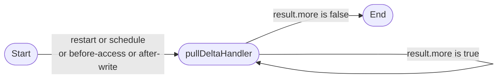

Fetching all the data from the target API at each update is not always possible, as it may be too slow, too expensive, or over the API rate limit.

Another strategy is to poll for changes on the target API and only fetch the records that changed.

This strategy is called "change polling".

# Choosing when to poll for changes

The following events are available:

- `pullDeltaOnRestart`: When true, your handler will be called on each agent restart
- `pullDeltaOnSchedule`: if set to a cron-like schedule, your handler will be called on that schedule. The syntax is the same as for `pullDumpOnSchedule`
- `pullDeltaOnBeforeAccess`: When true, your handler will be called before each access to the data source and the GUI will block until the handler returns
- `pullDeltaOnAfterWrite`: When true, your handler will be called after each write to the data source and the GUI will block until the handler returns

And an extra option is available to allow event grouping: `pullDeltaOnBeforeAccessDelay`

This value in milliseconds will add a delay to all read requests that are sent to your agent. This delay will allow your agent to group multiple requests that are sent during this delay and call your handler only once.

You can set this value to 0 to disable this feature or find a good balance between the number of calls to the target API and an acceptable delay.

```javascript
const myCustomDataSource = createReplicaDataSource({
  pullDeltaOnRestart: true, // Update cache each time the agent restarts.
  pullDeltaOnSchedule: '0 0 * * *', // Update cache each day at midnight.

  // Update cache each time data is accessed or written to from the GUI.
  pullDeltaOnBeforeAccess: true,
  pullDeltaOnAfterWrite: true,

  // Delay all read requests by 50ms to allow request grouping.
  pullDeltaOnBeforeAccessDelay: 50,

  // Handler to the records that changed from the API.
  pullDeltaHandler: async request => {
    // Implement handler here
  },
});
```

# Programming your handler

To be able to fetch only the records that changed, you need to implement a `pullDeltaHandler` function.

To know which records may have changed: a state object is preserved between calls, and you are allowed to read from the cache.

<details>
<summary>Structure of the `request` object</summary>

```javascript
{
  // This object is persisted between calls to the handler.
  // It is up to you to decide what to store in it so that you can detect changes.
  // It's value is:
  // - The last value you returned in the nextDeltaState field
  // - The value you provided on pullDumpHandler
  // - null otherwise
  previousDeltaState: { /* Any JSON serializable object */ },

  // When using `pullDeltaOnBeforeAccess` or `pullDeltaOnAfterWrite` flags, this
  // will contain the list of collections that are being accessed or written to.
  affectedCollections: ['...'],

  // Interface to read from the cache
  cache: { },

  // List of reasons why the handler was called
  reasons: [
    { name: 'startup' },
    { name: 'schedule' },
    { name: 'before-list', collection: '...', filter: ..., projection: ... },

  ]
}
```

</details>
<details>
<summary>Structure of the `response` object</summary>

```javascript
{
  // If all changes could not be fetched in a single call, you can set the `more`
  // flag to true.
  // This will cause the handler to be called again immediately.
  more: true,

  // Value that should be persisted in the `previousDeltaState` field of the next
  // call to the handler.
  nextDeltaState: {/* Any JSON serializable object */},

  // List of records that were updated or created since the last call to the
  // handler.
  newOrUpdatedEntries: [
    { collection: 'posts', record: { id: 134, title: '...' } },
    { collection: 'comments', record: { id: 15554, content: '...' } },
    { collection: 'comments', record: { id: 15555, content: '...' } },
  ],

  // List of records that were deleted since the last call to the handler.
  // This list is used to remove the records from the cache, so providing the
  // full record is not necessary.
  deletedEntries: [
    { collection: 'posts', record: { id: 34 } },
    { collection: 'comments', record: { id: 554 } },
  ]
};
```

</details>

# Example

```javascript
const myCustomDataSource = createReplicaDataSource({
  // Update cache before each data access
  pullDeltaOnBeforeAccess: true,

  // Handler to the records that changed from the API.
  pullDeltaHandler: async request => {
    // Initialize variables
    const url = 'https://jsonplaceholder.typicode.com';
    const nextDeltaState = { ...request.previousDeltaState };
    const newOrUpdatedEntries = [];
    const deletedEntries = [];

    // Get records that changed on the target API
    for (const collection of request.affectedCollections) {
      // Extract last timestamp for this collection from previousDeltaState
      const mostRecentDate = request.previousDeltaState[collection];

      // Request API
      const filter = `or($gt(updatedAt,${timestamp}), $gt(deletedAt,${timestamp}))`;
      const response = await axios.get(`${url}/${collection}?filter=${filter}`);
      const entries = response.data.map(record => ({ collection, record }));

      // Append the new records to the lists of entries
      newOrUpdatedEntries.push(...entries.filter(entry => !entry.record.deletedAt));
      deletedEntries.push(...entries.filter(entry => entry.record.deletedAt));
    }

    return { more: false, nextDeltaState, newOrUpdatedEntries, deletedEntries };
  },
});
```
